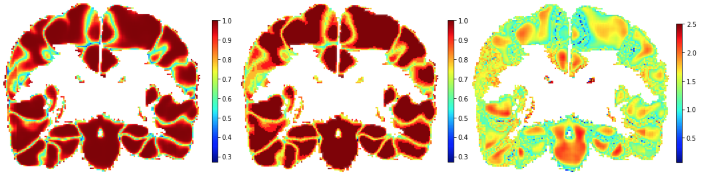
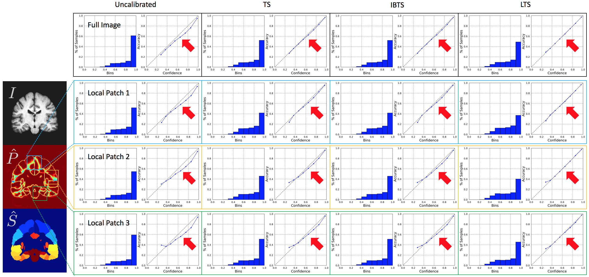
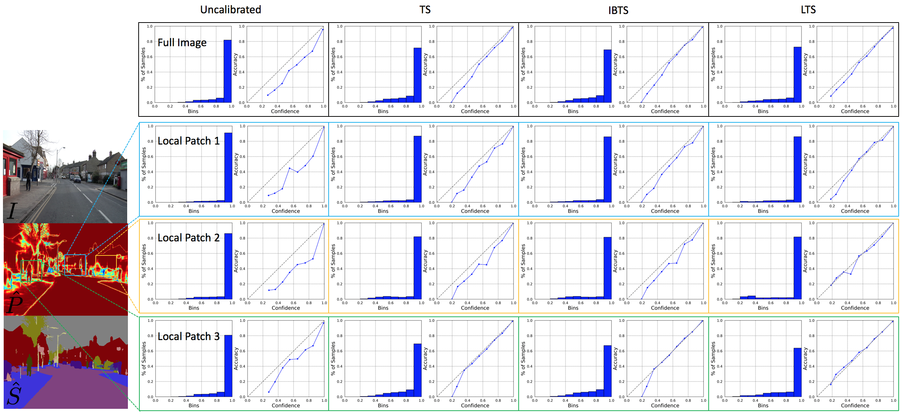
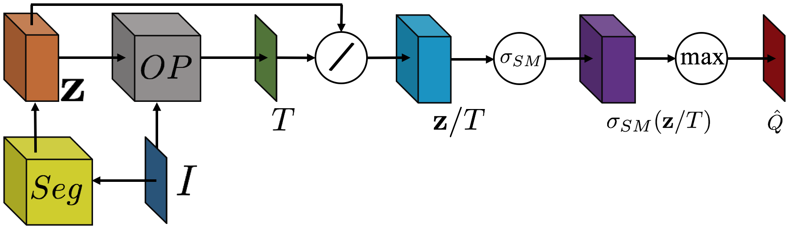
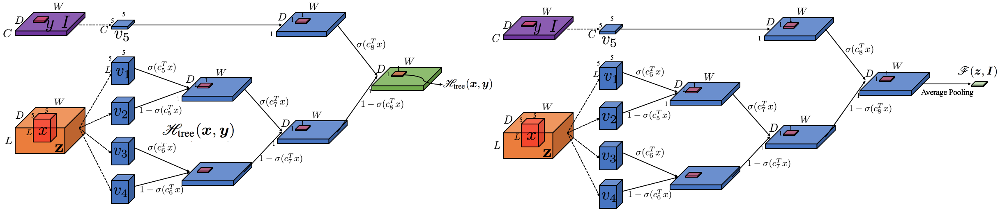

# Local Temperature Scaling (LTS)
This is the official repository for 
 
**Local Temperature Scaling for Probability Calibration**   
[Zhipeng Ding](https://biag.cs.unc.edu/author/zhipeng-ding/), [Xu Han](https://biag.cs.unc.edu/author/xu-han/), [Peirong Liu](https://biag.cs.unc.edu/author/peirong-liu/), and [Marc Niethammer](https://biag.cs.unc.edu/author/marc-niethammer/)   
*ICCV 2021*  [eprint arxiv](https://arxiv.org/abs/2008.05105)  

If you use LTS or some part of the code, please cite:
```
@article{ding2020local,
  title={Local temperature scaling for probability calibration},
  author={Ding, Zhipeng and Han, Xu and Liu, Peirong and Niethammer, Marc},
  journal={arXiv preprint arXiv:2008.05105},
  year={2020}
}
```

## Key Feasures
Different from previous probability calibration methods, **LTS** is a spatially localized probability calibration approach for semantic segmentation.

### Spatially Localized Feature
In the following figure, Left: Predicted probabilities (confidence) by a U-Net. Middle: Average accuracy of each bin for 10 bins of reliability diagram with an equal bin width indicating different probability ranges that need to be optimized for different locations. Right: Temperature value map obtained via optimization, revealing different optimal localized Temperature scaling values at different locations.

<p align="center">
  
</p>

In the following two figures, the top row shows the global reliability diagrams for different methods for the entire image. The three rows underneath correspond to local reliability diagrams for the different methods for different local patches. Note that temperature scaling (TS) and image-based temperature scaling (IBTS) can calibrate probabilities well across the entire image. Visually, they are only slightly worse than LTS. However, when it comes to local patches, LTS can still successfully calibrate probabilities while TS and IBTS can not. In general, LTS improves local probability calibrations.




### Theoretical Justification
With KKT conditions, we can prove that 
```
When the to-be-calibrated segmentation network is overconfident, 
minimizing NLL w.r.t. TS, IBTS, and LTS results in solutions that are also the solutions of 
maximizing entropy of the calibrated probability w.r.t. TS, IBTS and LTS under the condition of overconfidence.
```
Similarly, there is another theorem to validate the effectiveness of TS, IBTS and LTS under the condition of underconfidence in Appendix. 

### Implementation
The overall architecture for probability calibration via (local) temperature scaling is shown in the following figure. The output logit map of a pre-trained semantic segmentation network (*Seg*) is locally scaled to produces the calibrated probabilities. *OP* denotes optimization or prediction via a deep convolutional network to obtain the (local) temperature values.

<p align="center">
  
</p>

Specifically, in this paper, we use a simple tree-like convolutional network (See figure below) as in [(Lee et al.)](https://pages.ucsd.edu/~ztu/publication/pami_gpooling.pdf). However other neural network architectures could also work as illustrated by [(Bai et al.)](https://openreview.net/pdf?id=jsM6yvqiT0W). The following figures are the high-level illustration of the tree-like CNN. Left subfigure is for LTS and right subfigure is for IBTS. Detailed descriptions can be found in Appendix. 

<p align="center">
  
</p>

## Walk-through Exemplar
As an example, we use the [Tiramisu](https://arxiv.org/pdf/1611.09326.pdf) model for semantic segmentation on [CamVid](http://mi.eng.cam.ac.uk/research/projects/VideoRec/CamVid/) dataset. Note that other deep segmentation networks and datasets can also be used.  

### Deep Semantic Segmentation Network
Tiramisu is a fully convolutional densenet. The implementation and training details can be found this github [repository](https://github.com/bfortuner/pytorch_tiramisu). You need to modify the code accordingly in order to make it addaptive to your settings.

### Train Calibration Models
After getting logits from the segmentation model and properly set the dataloader, the next step is to train calibration model.
To train LTS, simply run
```
python Tiramisu_calibration.py --gpu 0 --model-name LTS --epochs 200 --batch-size 4 --lr 1e-4 --seed 2021 --save-per-epoch 1 
```

The table below is a collection of probability calibration models that can be used as baselines. You could pull this reposteries and modify the code accoradingly.
| Methods  | Implementations |
| ------------- | ------------- |
| [Temperature Scaling](https://arxiv.org/pdf/1706.04599.pdf)  | [TS](https://github.com/gpleiss/temperature_scaling)  |
| [Vector Scaling](https://arxiv.org/pdf/1706.04599.pdf)  | [VS](https://github.com/dirichletcal/experiments_neurips)  |
| [Isotonic Regression](https://citeseerx.ist.psu.edu/viewdoc/download?doi=10.1.1.13.7457&rep=rep1&type=pdf)  | [IsoReg](https://github.com/zhang64-llnl/Mix-n-Match-Calibration)  |
| [Ensemble Temperature Scaling](https://arxiv.org/pdf/2003.07329.pdf)   | [ETS](https://github.com/zhang64-llnl/Mix-n-Match-Calibration)   |
| [Dirichlet Calibration](https://arxiv.org/pdf/1910.12656.pdf)  | [DirODIR](https://github.com/dirichletcal/experiments_neurips)  |
| [Focal Loss Calibration](https://arxiv.org/pdf/2002.09437.pdf)  | [FL](https://github.com/torrvision/focal_calibration/tree/main/Losses)  |
| [Maximum Mean Calibration Error](https://proceedings.mlr.press/v80/kumar18a/kumar18a.pdf)  | [MMCE](https://github.com/torrvision/focal_calibration/tree/main/Losses)  | 

### Evaluation
To evaluate the four calibration metrics (ECE, MCE, SCE, and ACE) defined in the paper, simply run
```
python probability_measure_CamVid.py --gpu 0 --model_name LTS 
python probability_measure_Local_CamVid.py --gpu 0 --model_name LTS
```
For multi-atlas segmentation experiment to validate the probability calibration, please refer to [VoteNet-Family](https://github.com/uncbiag/VoteNet-Family.git) for details.
